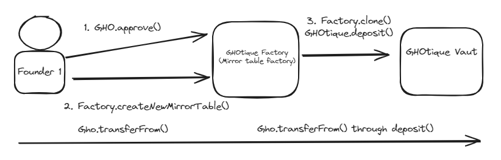

# GHOtique Vaults


## Project description
The project has 2 main contracts:
- `GHOtiqueFactory.sol` creates minimal, configurable clones of the Ghotique vaults. This Factory lets us choose the name and symbol of the ERC4626 shares token, as well as the initial set of authorized vault signers, minimum number of confirmations and minimun initial investment.

- `Ghotique.sol` is an ERC4626 vault and a Multisig wallet that serves as both the cap table registry (through the emission of Vaut shares) and as Company Treasury with its Multisig Functionality. 

Users can invest using the `deposit()` function. They will get shares (anoter ERC20 token) back in an exchange rate of 1-1 to their original investment. The value of those shares fluctuate according to the amount of GHO tokens inside the vault

Users can get their investment and profits back with the `redeem()` function. They will burn their Vault shares and get back their corresponding value in GHO according to the amount of GHO in the vault.

Eventually, if an investor wants to take profits, his share of investment will decrease if he redeems shares. This is one use case in the traditional finance world. However, there is another use case where the payments of dividends do not dilute any of the existing investors. Given that these Vault also include a Multisig, a potential solution is to deploy a Payment Splitter contract and send the assets to be distributed among the investors there (work for the future).

Anyone can invest resources in the company, but only the Founders or other authorized signers can execute transactions over the vaults assets, after getting past the minimum threshold of approvals. The value of the shares decrease as the resources are utilized so even if they are immediately redeemable it is not advisable to do so until the company returns the generated profits or cashflow to the vault. 

Arbitrary transaction execution has its risks by definition. However, we consider that this is no different than what happens in traditional Angel investing, with the difference that in this case, all transactions are transparent and the responsible signers are identified.

## Workflow
1. Original Founder calls `approve()` on the GHO token to authorize the `GHOtiqueFactory.sol` to move `minimalInvestmentAmount` of assets on its behalf.

2. Original Founder creates the GHOtique Vault through the factory. 
The founder will need to provide details to configure the Vault:
    - Name of the company
    - Ticker
    - Initial multisig signers
    - Initial number of multisig confirmations
    - Initial investment.

Initial investment will be transferred to the newly created vault in the same transaction. This is in order to avoid inflation attacks so the Founder wallet will need to hold the needed amount of GHO tokens.
3. The other founders need to use `approve()` on the `GHOtique` vault (NOT the `GHOtiqueFactory.sol`)
4. The founders use `deposit()` to transfer assets to the vault and get shares back.
5. Whenever an investor wants to burn his shares and get GHO back, he can use the `redeem()` function.

To get full examples on how to use these functions and their parameters, please look into `test/Ghotique.t.sol`

## Instructions.
Assuming you already have Rust and Foundry installed.

See the [Book of Foundry](https://book.getfoundry.sh/projects/working-on-an-existing-project.html) to learn more.

1. 
```bash
forge install
```
2. Compile the project
```bash
forge build
``` 
3. Run test suite
```bash
forge test
```

### Generate docs based on Natspec on files

```bash
forge doc
```

### Check test coverage 
```bash
forge coverage
```

### Run Foundry formater
```bash
forge fmt
``` 

## Get all functions selectors from a contract
```bash
forge inspect <YourContractName> methods
```

## Run Locally

Open Anvil local node
```bash
anvil
```
## Safely store your private keys
Encryption using ERC2335

In the forge console:
1. Open the interactive console to import your private key
```bash
cast wallet import <KEYNAME> --interactive
```
2. Paste your private key in the prompt
3. Input a password for that key (remember, a safe and brand-new one. REMEMBER it)

See all stored keys
```bash
cast wallet list
```

Use it in your scripts like I do on the following scripts

View the [full video from Patrick Collins](https://www.youtube.com/watch?v=VQe7cIpaE54) for Cyfrin if it's not clear 

## Load .env variables (Use for everything BUT your private keys)
Load .env variables 
in .env file->NO spaces between variable name and value, value with quotes. ETHERSCAN_KEY="blablabla"

```bash
source .env
```
Run on local node
Note `--sender` is the public address of your private key
```bash
forge script script/DeployLocal.s.sol:Deploy --fork-url http://localhost:8545 --account <PRIVATE_KEY_NAME> --sender <ACCOUNT_ADDRESS> --broadcast -vvvv
```

**Deploy to Sepolia**

Deploy to Sepolia and verify.
Note `--sender` is the public address of your private key
```bash
forge script script/DeployTestnet.s.sol:Deploy --rpc-url $SEPOLIA_KEY  --account <PRIVATE_KEY_NAME> --sender <ACCOUNT_ADDRESS> --broadcast --verify --etherscan-api-key $ETHERSCAN_KEY -vvvv
```

GHO token 0xc4bF5CbDaBE595361438F8c6a187bDc330539c60
deposit gho, use gho
deposit anything, use gho

